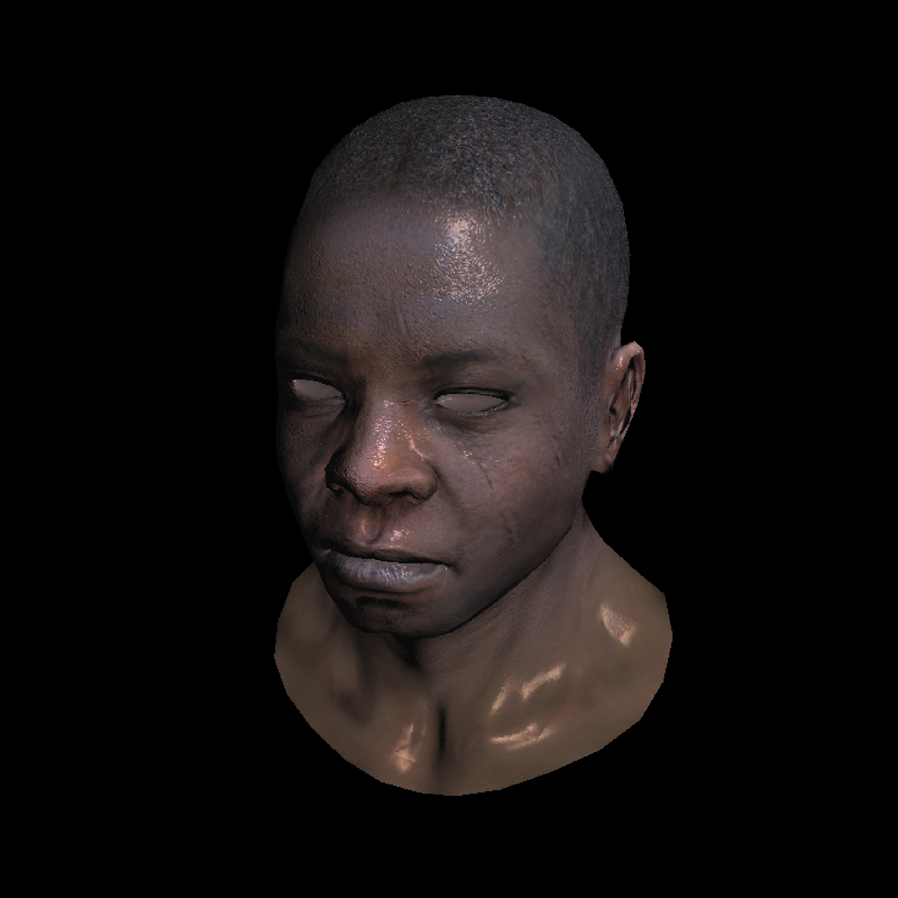

# tinyrender

tinyrender is a Rust port of the C++ tinyrenderer project: https://github.com/ssloy/tinyrenderer

## Installation

```bash
git clone https://github.com/Raunak-S/tinyrender.git
```

## Usage

```bash
cargo run -r -- --obj-path <path_to_file>
```
## Renders

```
Using obj/african_head/african_head.obj
```


```
Using obj/diablo3_pose/diablo3_pose.obj
```


## Resource

- https://doc.rust-lang.org/book/ch14-01-release-profiles.html
- https://doc.rust-lang.org/cargo/reference/profiles.html
- https://github.com/flamegraph-rs/flamegraph

## License

[MIT](https://choosealicense.com/licenses/mit/)